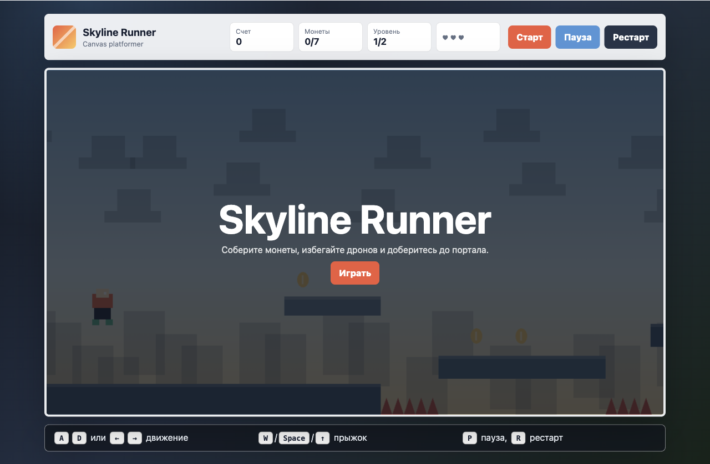

# Skyline Runner

Практическое задание 3: веб-игра в жанре платформер на JavaScript с использованием HTML5 Canvas API.

## Использование нейросети

- Нейросеть: ChatGPT / Codex.
- Время выполнения: примерно 2 часа.
- С помощью нейросети созданы: структура проекта, классы игры, физика персонажа, система коллизий, уровни, интерфейс, стили и текст README.

## Функционал

- Управление персонажем: движение влево/вправо, прыжок и двойной прыжок.
- Игровая физика: гравитация, ускорение, трение, ограничение скорости.
- Коллизии с платформами и препятствиями.
- Сбор монет и подсчет очков.
- Враги, которых можно победить прыжком сверху.
- Два уровня с разной сложностью.
- Условия победы и поражения.
- Кнопки старт, пауза и рестарт.
- Сохранение лучшего результата в `localStorage`.

## Управление

- `A` / `D` или стрелки влево/вправо — движение.
- `W`, `Space` или стрелка вверх — прыжок.
- `P` — пауза.
- `R` — рестарт.
- `Enter` — старт после меню или паузы.

## Структура проекта

```text
index.html
css/
└── style.css
js/
├── main.js
├── Game.js
├── Player.js
├── Platform.js
├── Collision.js
└── InputHandler.js
assets/
├── images/
└── sounds/
```

## Запуск

Откройте `index.html` в браузере или запустите локальный сервер:

```bash
python3 -m http.server 8000
```

После этого игра будет доступна по адресу:

```text
http://localhost:8000
```

## GitHub Pages

Для публикации:

1. Создайте репозиторий на GitHub.
2. Загрузите файлы проекта в репозиторий.
3. Откройте `Settings` -> `Pages`.
4. Выберите ветку `main` и папку `/root`.
5. Сохраните настройки и дождитесь появления ссылки GitHub Pages.

## Скриншот


